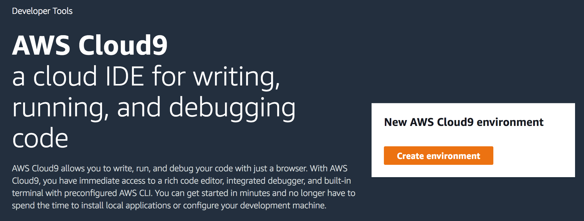
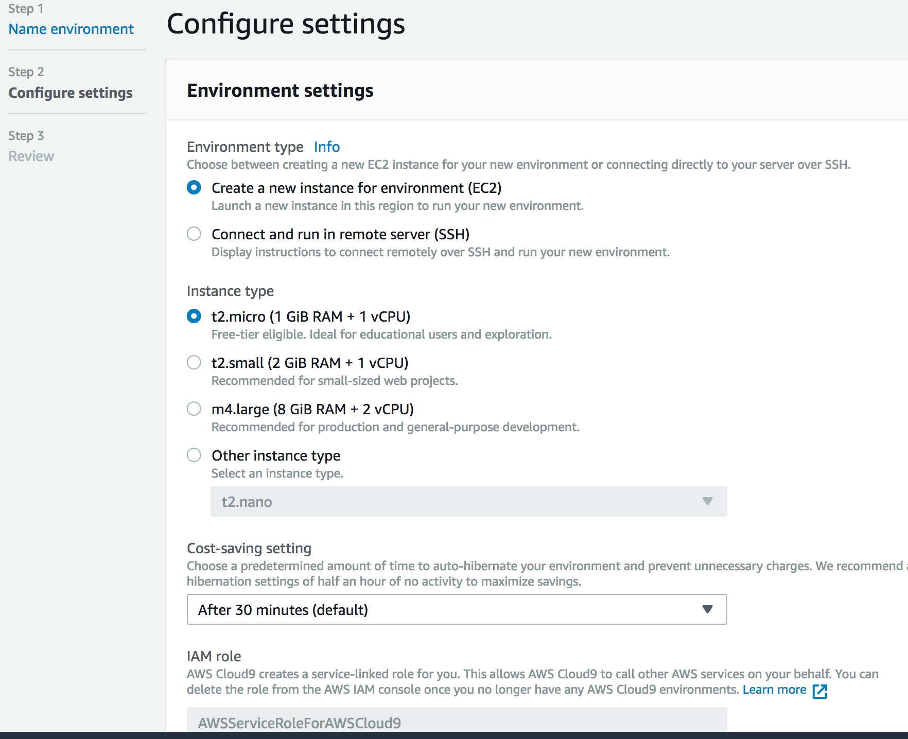
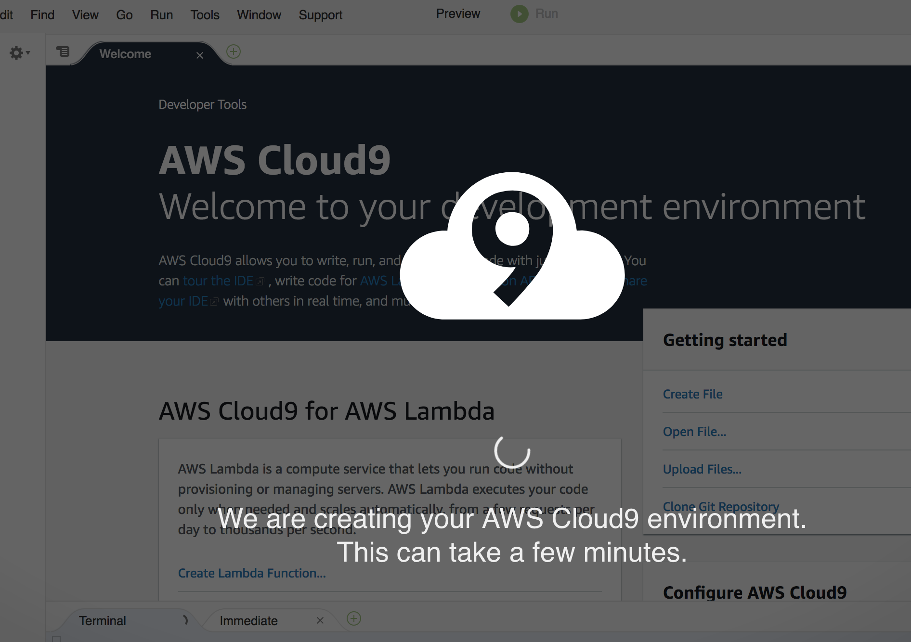

# Cloud9

[AWS Cloud9](https://aws.amazon.com/cloud9/) is a cloud-based integrated development environment (IDE) that lets you write, run, and debug your code with just a browser. It includes a code editor, debugger, and terminal.

Cloud9 comes prepackaged with essential tools for popular programming languages, including [JavaScript](https://aws.amazon.com/developer/language/javascript/), [Python](https://aws.amazon.com/developer/language/python/), [PHP](https://aws.amazon.com/developer/language/php/) and [more](https://aws.amazon.com/developer/), so **you don’t need to install files or configure your development machine to start new projects**.

Since your Cloud9 IDE is cloud-based, you can work on your projects from your office, home, or anywhere using an internet-connected machine. Cloud9 also provides a seamless experience for developing **serverless** applications enabling you to easily define resources, debug, and switch between local and remote execution of **serverless** applications.

With Cloud9, you can quickly share your development environment with your team, enabling you to pair program and track each other's inputs in real time.

## Setting up

1. Cloud9 is available directly from the [AWS Management Console](https://console.aws.amazon.com/console/home). You can search for Cloud9 and then click on `Create environment`

    

2. Default options will create a new underlying EC2 instance -- you can select any available instance type (_t2.micro_ would work just fine)

    

3. Your IDE in the cloud would become available in a few seconds.

    

With Cloud9 the environment will be created for you. `git`, `docker`, `sam`, `aws` and major programming languages support are built-in. The [complete list](https://docs.aws.amazon.com/cloud9/latest/user-guide/ami-contents.html) of AMI contents is also available.

To learn more about developing serverless application with Cloud9 please refer to [Working with AWS Lambda Functions in the AWS Cloud9 Integrated Development Environment](https://docs.aws.amazon.com/cloud9/latest/user-guide/lambda-functions.html?icmpid=docs_ac9_console_or_ide) on [AWS Documentation](https://aws.amazon.com/documentation/).

Once your Cloud9 IDE is up and running you can use its Terminal tab and move forward with the hands-on labs.